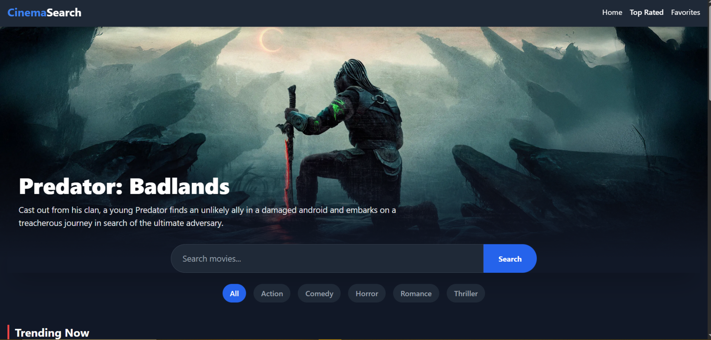
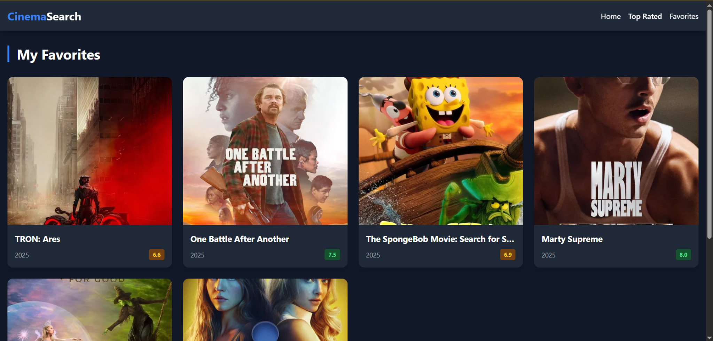
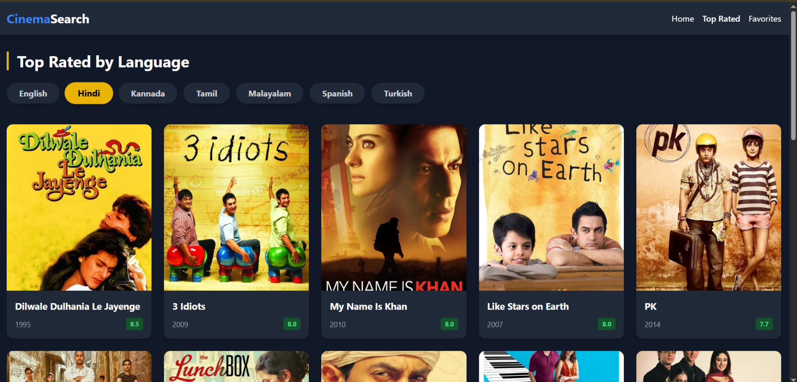

# 🎬 CinemaSearch - Feature-Rich Movie App

**Internship Task 2: Movie Search Application**

A professional, responsive React application built for movie enthusiasts. This app mimics modern streaming platforms like Netflix, allowing users to browse trending content, search for specific titles, view detailed cast/crew info, and filter top-rated movies by specific languages.

🔗 **Live Demo:** https://movie-search-app-phi-three.vercel.app/

---

## 📸 Screenshots

### 1. Home Page & Hero Banner

*Features a dynamic Hero Banner that changes based on trending movies, plus a smart search bar and genre filters.*



### 2. Top Rated by Language

*A specialized feature to filter top 100 movies in English, Hindi, Kannada, Tamil, Malayalam, Spanish, and Turkish.*



### 3. Favorites (Watchlist)

*Users can save movies to a personal list. Data is persisted using LocalStorage.*



---

## ✨ Features Implemented

### 1. 🏠 Immersive Home Experience
*   **Cinematic Hero Section:** The top trending movie is displayed as a large banner with a high-res backdrop, title, and overview.
*   **Dynamic Search:** A sleek search bar that adjusts its position based on whether a banner is present or not.
*   **Genre Quick Filters:** Users can instantly filter the home feed by categories: **Action, Comedy, Horror, Romance, and Thriller**.

### 2. 🌍 Top Rated Regional & International
A dedicated page (`/top-rated`) to explore high-quality cinema across the world.
*   **Language Support:** One-click tabs to switch between:
    *   🇬🇧 English
    *   🇮🇳 Hindi
    *   🇮🇳 Kannada
    *   🇮🇳 Tamil
    *   🇮🇳 Malayalam
    *   🇪🇸 Spanish
    *   🇹🇷 Turkish
*   **Pagination:** Includes a "Load More" button to fetch up to 100 movies per language.
*   **Quality Filter:** Algorithms ensure only movies with significant vote counts are shown.

### 3. 📄 Comprehensive Movie Details
Clicking any movie card navigates to a detailed view containing:
*   **Official Trailer:** Auto-embeds the official YouTube trailer.
*   **Top Cast:** A horizontal scrollable list of the lead actors and their character names.
*   **Key Stats:** Displays Rating, Runtime, Release Year, Budget, and Revenue.
*   **Backdrop Visuals:** Immersive background styling using TMDB high-res assets.

### 4. 💖 Smart Watchlist System
*   **Global State Management:** Uses React Context API to manage the favorites list across the entire app.
*   **Persistent Storage:** Saves the user's list to the browser's `localStorage`, so data is never lost on refresh.
*   **Visual Feedback:** Heart icons update instantly to reflect the "Saved" status.

### 5. 🎨 UI/UX Excellence
*   **Responsive Design:** Grid layouts automatically adjust for Mobile (1 col), Tablet (3 cols), and Desktop (5 cols).
*   **Dark Mode:** Built with a "Cinema Dark" theme (`bg-gray-900`) for the best viewing experience.
*   **Animations:** Smooth hover effects (Zoom + Overlay) on movie cards.

---

## 🛠️ Tech Stack

*   **Frontend Framework:** React.js (Vite)
*   **Styling:** Tailwind CSS (v3)
*   **Routing:** React Router DOM (v6)
*   **State Management:** React Context API + useReducer
*   **API Integration:** Axios
*   **Data Source:** [TMDB API](https://www.themoviedb.org/)
*   **Icons:** React Icons (FontAwesome & HeroIcons)

---

## ⚙️ Installation & Setup

If you want to run this project locally, follow these steps:

1.  **Clone the repository**
    ```bash
    git clone https://github.com/YOUR_USERNAME/movie-search-app.git
    cd movie-search-app
    ```

2.  **Install Dependencies**
    ```bash
    npm install
    ```

3.  **Configure API Key**
    Create a `.env` file in the root directory and add your TMDB API key:
    ```env
    VITE_TMDB_API_KEY=your_api_key_here
    ```

4.  **Run the Project**
    ```bash
    npm run dev
    ```

## 📧 Contact & Internship Details
*   **Developer:** PRANATHI G R
*   **Internship:** CODTECH IT SOLUTIONS
*   **Task:** Task 2 - Movie Search App
*   **ID:** CTISAK77

---
*Made with ❤️ using React & TMDB.*
